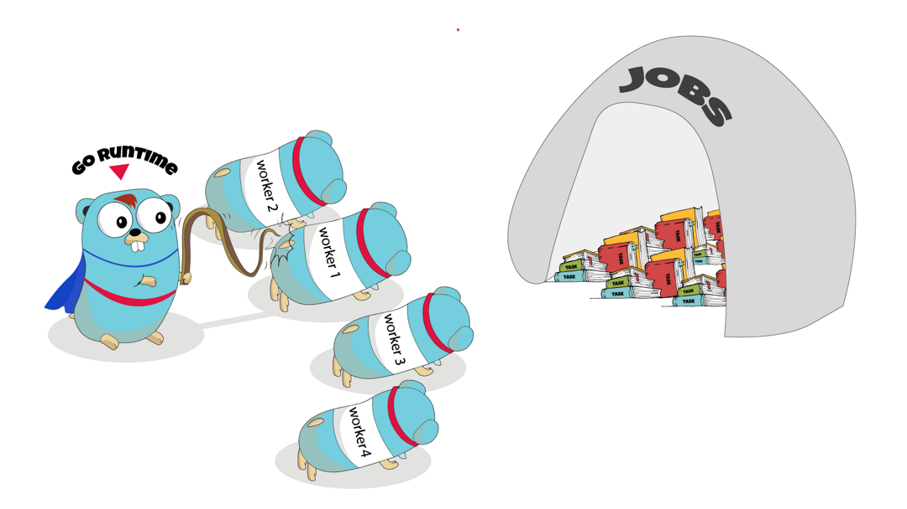

<h1 align="center">
<br/>
Work Synchronizer
</h1>
<p align="center">Schedule Works for different types of workers on different machines backed by only a single `mysql` table.
</p>

<p align="center">
<a href="https://pkg.go.dev/github.com/mehditeymorian/worksync?tab=doc"target="_blank">
    
</a>&nbsp;


</p>

## Why this library
- Small Codebase
- Minimum dependency to other libraries
- Flexibility to integrate into workers

## Download
```
go get github.com/mehditeymorian/worksync@latest
```

## How the Sync Happens?
All the works are managed by a `scheduler` backed by `MYSQL`. The scheduler takes a list of work blueprints with the following attributes:
```go
type Work struct {
	// unique name for the work
	Name   string
	// cron expression of when the worker is going to be executed
	Cron   string
	// number of times the work must be executed.
	// Note that it is only guaranteed that 
	// the number of workers acquiring this work not to surpass this value.
	MaxRun int64
}
```
The Scheduler then create works before the schedule of each workers based on `MaxRun` value. Then at the scheduled time, each worker try to acquire work by updating the status of the work. If there is work with `Queued` status, the worker will acquire the work. otherwise, it fails.
> Note: each sequence of works is known by worker `name` and a `sequence` value. These two values must be the same on scheduler and on the worker side while tring to acquire work.
> 
> By default, scheduler set `sequence` as run schedule formatted by `time.DateTime`. The sequence generator can be customized in schedule's config.

## How to Use
Create the following table in MYSQL
```sql
create table if not exists [DATABASE].[TABLE]
(
    id          int auto_increment
        primary key,
    created_at  datetime     null,
    name        varchar(255) null,
    status      int8         null,
    sequence    varchar(255) null,
    started_at  datetime     null,
    finished_at datetime     null
);
```
Then connect as follows:
```go
package main

import (
	...
        // import the proper driver for connection
        _ "github.com/go-sql-driver/mysql"
)

func main() {
    db, err := sql.Open("mysql", dsn)
    if err != nil {
        panic(err)
    }
    
    syncDB := worksync.NewDBConnection(db, TableName)

}
```


### Client Side
In client-side it only requires to call the `acquireWork` before doing the work.
```go
package main

func main() {

	workSync := worksync.NewSyncer(syncDB)
	
	fancyWorker.do(func() {
		success, fail, err := workSync.AcquireWork(name, now.Format(time.DateTime))
		if err != nil {
                    return
		}
		
		// actual work
	})

}
```

### Server Side
```go
package main

import (
	"worksync"
)

func main() {

	works := []*worksync.Work{
		{
			Name:   name,
			Cron:   cronExpr,
			MaxRun: maxRun,
		},
		// list of works ...
	}

	scheduler, err := worksync.NewScheduler(syncDB, works, &worksync.SchedulerConfig{
		// when to create the works. in this case it will create the work if duration before execution time is less than 5sec.
		DurationBeforeSequence:    time.Duration(5) * time.Second,
		// interval to check for creating works
		SchedulerCheckingInterval: "@every 2s",
		SequenceGenerator:         nil,
	})

	// non-blocking
	scheduler.StartSchedule()


}
```


## Cron Expressions
We use [robfig/cron](https://github.com/robfig/cron) for handling Crons. Please refer to their documentation on how to write cron expressions. [Link](https://pkg.go.dev/github.com/robfig/cron)
